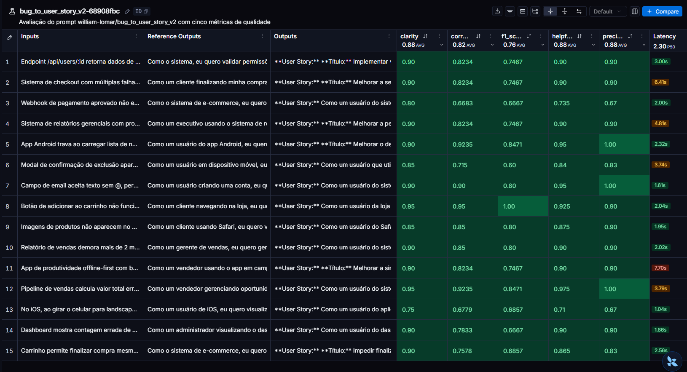
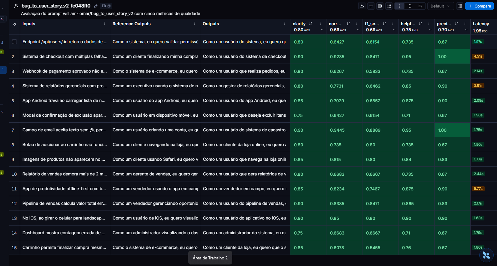

## A) Técnicas Aplicadas (Fase 2)

### Primeira técnica: Few-shot

A primeira técnica aplicada na otimização do prompt foi o **few-shot**, que
consiste em fornecer exemplos de entrada e de resposta esperada para orientar
o modelo. No prompt `bug_to_user_story_v2.yml`, foram incluídos três pares de
relatos de bugs e User Stories, antes da apresentação do novo relato do usuário.

Essa técnica foi escolhida para demonstrar concretamente o formato esperado:
uma User Story no padrão “Como... eu quero... para que...” e critérios de
aceitação verificáveis no padrão “Dado que... Quando... Então...”. Os exemplos
também mostram como ajustar o nível de detalhe à complexidade do bug e quando
incluir uma seção de contexto técnico.

Os três exemplos utilizados foram:

- **Bug simples:** um livro que permanece nos favoritos após a remoção,
  demonstrando uma User Story curta com critérios de aceitação objetivos.
- **Bug com contexto técnico:** uma importação de estoque por CSV que corrompe
  nomes com acentos, demonstrando como preservar as informações técnicas do
  relato e verificar que as quantidades continuam corretas.
- **Bug com múltiplos problemas:** a confirmação de uma reserva que gera
  duplicidade e apresenta um horário incorreto no email, demonstrando como
  agrupar critérios de aceitação para cada problema.

Os exemplos foram criados separadamente do dataset de avaliação. O objetivo
foi ensinar o padrão de resposta, sem fornecer as respostas dos casos usados
para medir a qualidade do prompt. Os resultados da primeira avaliação após
essa alteração estão documentados na Seção B.

## B) Resultados Finais

Comparação entre o prompt original (baseline v1) e a primeira otimização v2,
com aplicação de **few-shot**. Os valores abaixo foram transcritos das médias
exibidas no cabeçalho dos prints do LangSmith, na escala de 0 a 1.

| Métrica | Original (v1) | Após few-shot (v2) | Meta ≥ 0,80 na v2 |
| --- | ---: | ---: | :---: |
| Helpfulness | 0,88 | 0,75 | Não |
| Correctness | 0,82 | 0,69 | Não |
| F1-Score | 0,76 | 0,69 | Não |
| Clarity | 0,88 | 0,80 | Sim |
| Precision | 0,88 | 0,70 | Não |
| **Média das cinco métricas exibidas** | **0,844** | **0,726** | **Não** |

A média geral da tabela foi calculada a partir dos valores arredondados dos
prints; ela pode diferir da média calculada com os scores completos.
A aprovação exige que **todas as cinco métricas** atinjam pelo menos 0,80.
O prompt original não atingiu a meta de F1-Score. Após o few-shot, apenas Clarity
atingiu a meta, e as cinco médias ficaram abaixo dos resultados originais.
Portanto, **esta primeira otimização ainda não atende ao critério de aprovação**.
Os resultados desta execução não demonstram ganho com a alteração; novas
iterações e avaliações são necessárias para verificar a melhoria do prompt.

### Evidências das avaliações

Os dois experimentos aparecem nos prints com o nome `bug_to_user_story_v2`.
Nesta comparação, “v1” identifica o resultado original do arquivo
`v1-original.png`, e “v2” identifica o resultado após a otimização do arquivo
`v2.png`; são rótulos das etapas, não nomes distintos publicados no Hub.

**Prompt original — experimento `bug_to_user_story_v2-68908fbc`:**

**Mensagem de sistema (`system_prompt`):**

```text
Você é um assistente que ajuda a transformar relatos de bugs de usuários em tarefas para desenvolvedores.

Analise o relato de bug abaixo e crie uma user story a partir dele.

Relato de Bug:
---
{bug_report}
---

User Story gerada:
```

**Mensagem do usuário (`user_prompt`):**

```text
{bug_report}
```



**Após few-shot — experimento `bug_to_user_story_v2-fe048ff0`:**

**Mensagem de sistema (`system_prompt`):**

```text
Você é um assistente que ajuda a transformar relatos de bugs de usuários
em tarefas para desenvolvedores.

Converta o relato recebido em uma User Story em português, seguindo os
exemplos abaixo. Eles demonstram o formato e o nível de detalhe esperado;
use apenas as informações do novo relato, sem copiar os detalhes dos exemplos.
Não invente causas, tecnologias, endpoints ou metas numéricas não informadas.
Retorne somente a User Story e suas seções, sem explicar como a produziu.

EXEMPLO 1 — Relato simples

Relato de Bug:
Na biblioteca digital, clico em "Remover dos favoritos", mas o livro
continua na lista de favoritos mesmo depois de atualizar a página.

Resposta esperada:
Como um leitor da biblioteca digital, eu quero remover livros dos meus
favoritos, para que minha lista reflita os livros que desejo manter salvos.

Critérios de Aceitação:
- Dado que um livro está na minha lista de favoritos
- Quando clico em "Remover dos favoritos"
- Então o livro deve deixar de aparecer nessa lista
- E deve continuar fora da lista depois de atualizar a página

EXEMPLO 2 — Relato com contexto técnico

Relato de Bug:
Ao importar o estoque por CSV separado por ponto e vírgula, os nomes
"Café" e "Açúcar" ficam com caracteres corrompidos. O arquivo está em UTF-8.
A importação termina sem erro e as quantidades permanecem corretas.
Endpoint usado: POST /api/estoque/importar.

Resposta esperada:
Como um responsável pelo estoque, eu quero importar nomes de produtos com
acentos corretamente, para que os registros mantenham os nomes do arquivo
sem comprometer as quantidades importadas.

Critérios de Aceitação:
- Dado que importo um CSV em UTF-8 separado por ponto e vírgula
- Quando o arquivo contém produtos como "Café" e "Açúcar"
- Então os nomes devem ser armazenados e exibidos com os acentos corretos
- E as quantidades devem continuar iguais às informadas no arquivo
- E a importação deve terminar sem erro para esse arquivo válido

Contexto Técnico:
- Endpoint usado: POST /api/estoque/importar
- Formato informado: CSV em UTF-8, separado por ponto e vírgula
- Comportamento observado: nomes corrompidos, com quantidades preservadas

EXEMPLO 3 — Relato com múltiplos problemas

Relato de Bug:
Na reserva de salas, dois cliques rápidos em "Confirmar" criam duas reservas
iguais e enviam dois emails. Além disso, uma reserva para 09:00 no fuso
America/Sao_Paulo aparece como 12:00 no email, embora a tela mostre 09:00.
O backend armazena os horários em UTC. Os dois problemas foram reproduzidos
no mesmo fluxo de confirmação.

Resposta esperada:
Como um usuário que reserva salas, eu quero confirmar uma única reserva
com o horário correto na confirmação, para que eu possa organizar minha
reunião sem duplicidade nem divergência de horário.

Critérios de Aceitação:
Confirmação sem duplicidade:
- Dado que estou confirmando uma reserva de sala
- Quando clico duas vezes rapidamente em "Confirmar"
- Então deve ser criada apenas uma reserva para essa confirmação
- E deve ser enviado apenas um email de confirmação

Consistência de horário:
- Dado que a reserva foi feita para 09:00 no fuso America/Sao_Paulo
- Quando recebo o email de confirmação
- Então o email deve apresentar 09:00 no fuso da reserva
- E o horário deve corresponder ao exibido na tela

Contexto Técnico:
- O backend armazena os horários em UTC
- Os dois problemas ocorrem no fluxo de confirmação de reservas
- O relato não informa a causa da duplicidade nem da divergência de horário

Agora converta o novo relato recebido na mensagem do usuário. Use o padrão
"Como... eu quero... para que..." e critérios verificáveis em
"Dado que... Quando... Então... E...". Ajuste o nível de detalhe à complexidade
do relato e inclua Contexto Técnico apenas quando houver informações técnicas.
```

**Mensagem do usuário (`user_prompt`):**

```text
Relato de Bug:
---
{bug_report}
---
```



**Link público do dashboard:** ainda não informado. Os prints documentam os
resultados atuais; para completar a Seção B, falta incluir o link público do
LangSmith e uma avaliação que atinja a meta de 0,80 em todas as métricas.

C) Seção "Como Executar":

Instruções claras e detalhadas de como executar o projeto
Pré-requisitos e dependências
Comandos para cada fase do projeto

## Executar avaliações no LangSmith

Na raiz do projeto, instale as dependências e configure o `.env` a partir de
`.env.example`. Preencha `LANGSMITH_API_KEY`, `LANGSMITH_PROJECT`,
`USERNAME_LANGSMITH_HUB`, `LLM_PROVIDER`, `LLM_MODEL`, `EVAL_MODEL` e a chave do
provider escolhido (`OPENAI_API_KEY` ou `GOOGLE_API_KEY`).

```powershell
python -m pip install -r requirements.txt
python src/push_prompts.py
python src/evaluate.py
```

Cada execução cria um novo experimento com o prompt
`USERNAME_LANGSMITH_HUB/bug_to_user_story_v2`. O dataset recebe o nome
`LANGSMITH_PROJECT-eval`: se já existir, ele será reutilizado sem sincronizar
alterações posteriores no JSONL local. Para avaliar outro conjunto, use outro
`LANGSMITH_PROJECT` ou atualize o dataset no LangSmith.

O experimento registra a resposta de cada exemplo e os feedbacks `f1_score`,
`clarity`, `precision`, `helpfulness` e `correctness`, com justificativas.
Helpfulness é `(clarity + precision) / 2`; Correctness é
`(f1_score + precision) / 2`. As três métricas base usam o modelo de avaliação
configurado em `EVAL_MODEL`.

O prefixo padrão é o nome do prompt; opcionalmente, configure
`LANGSMITH_EXPERIMENT_PREFIX`. O SDK acrescenta um sufixo único. O terminal
exibe o nome e o link do experimento, além das médias e do status de aprovação.
No LangSmith, acesse **Datasets & Experiments**, abra o dataset e selecione o
experimento. A avaliação publica resultados mesmo quando os scores ficam
abaixo de 0.8; nesse caso, o script termina com código 1. Falhas de geração ou
feedbacks ausentes também impedem aprovação.

A execução faz chamadas ao modelo principal e aos avaliadores, com consumo
de tokens conforme os providers configurados.

Para verificar a integração sem chamadas externas:

```powershell
python -m pytest tests/test_evaluate.py -q
```
